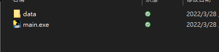
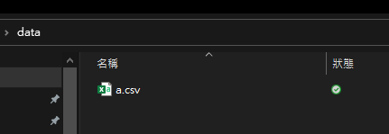
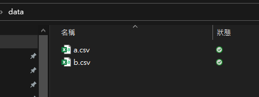
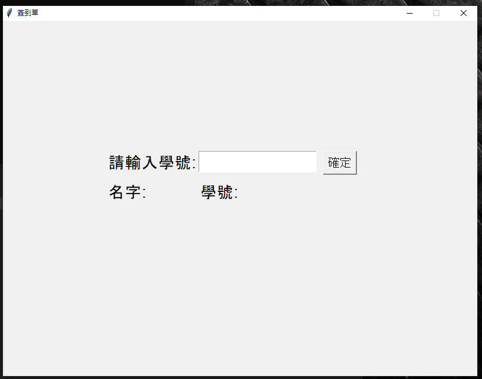
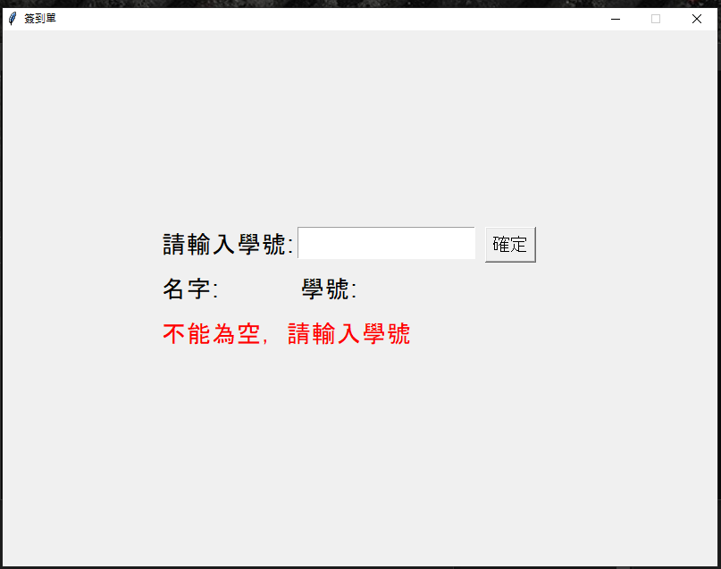
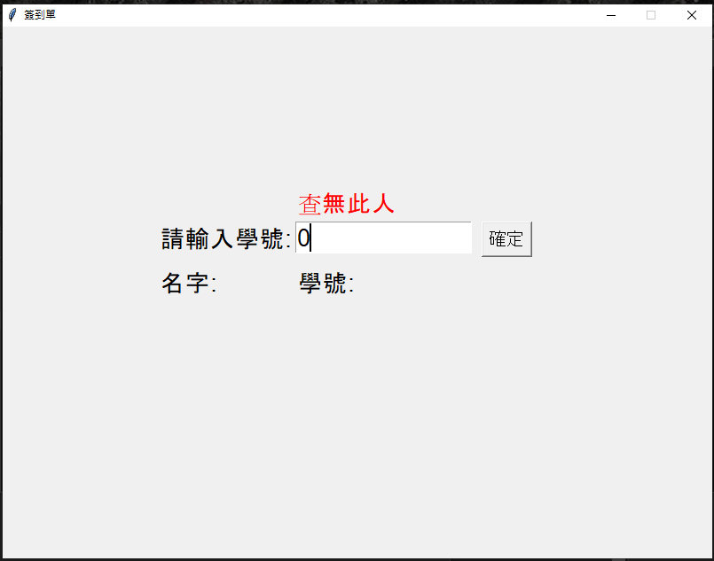
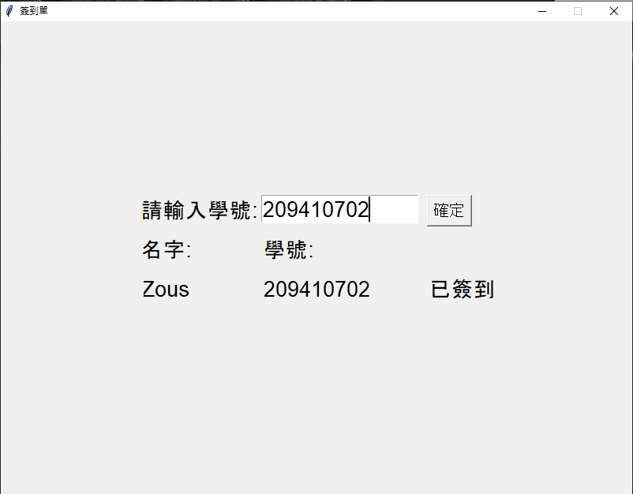

# HINT 1: 當前目錄下要有 data 的資料夾

# HINT 2: data 資料夾的名單檔案要是 a.csv

# HINT 3: 生成出來的簽到單叫已簽到.csv

# HINT 4: 使用者介面

# HINT 5: 沒有輸入任何東西，顯示不能為空請輸入學號

# HINT 6: 學號輸入錯誤，輸出查無此人

# HINT 7: 學號輸入正確，輸出姓名、學號、已報到

